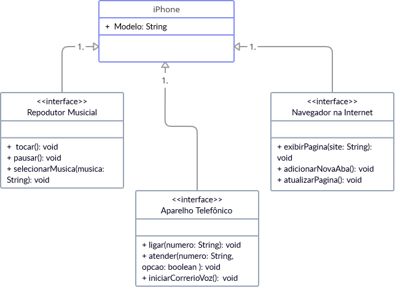

# Diagrama de Classes UML: Diagramação de Classes do Iphone

[Requisitos](https://github.com/digitalinnovationone/trilha-java-basico/tree/main/desafios/poo)

Elabore em uma ferramenta de UML de sua preferência a diagramação das classes e interfaces com a proposta de representar os papéis do iPhone de: Reprodutor Musicial, Aparelho Telefônico e Navegador na Internet. Em seguida crie as classes e interfaces no formato de arquivos .java

- Repodutor Musicial: tocar, pausar, selecionarMusica
- Aparelho Telefônico: ligar, atender, iniciarCorrerioVoz
- Navegador na Internet: exibirPagina, adicionarNovaAba, atualizarPagina

